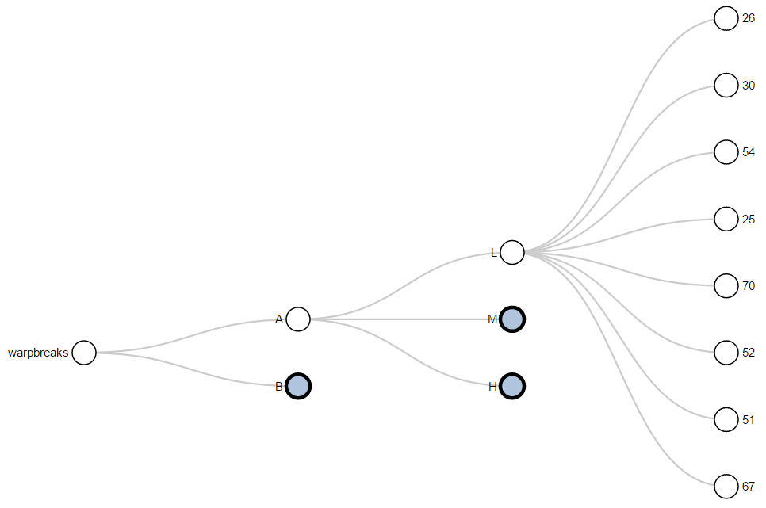
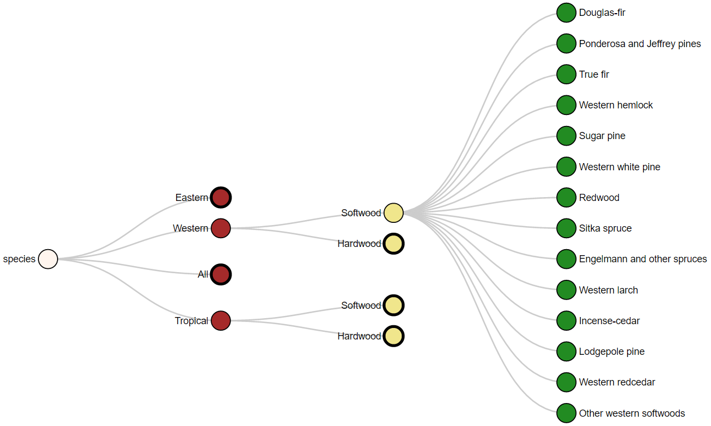
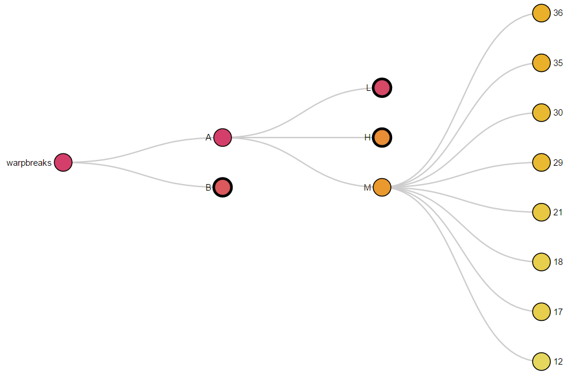
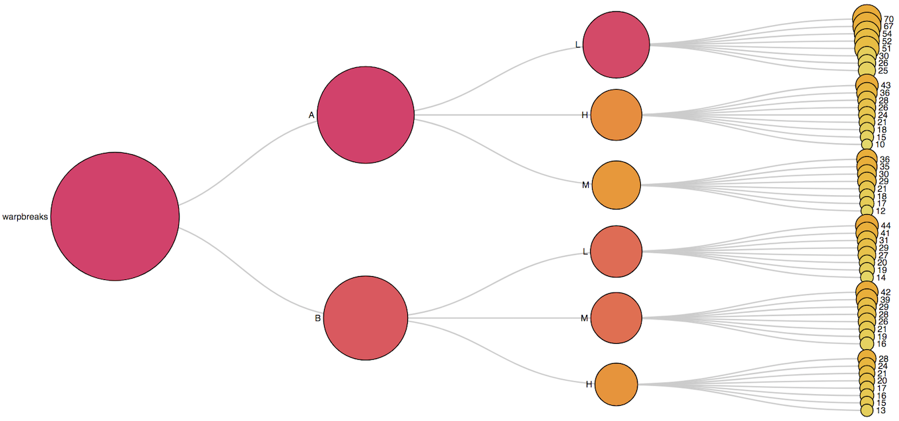

<!-- README.md is generated from README.Rmd. Please edit that file -->
collapsibleTree 0.1.5
=====================

[](https://cran.r-project.org/package=collapsibleTree) [](https://cran.r-project.org/package=collapsibleTree)

collapsibleTree is an R [htmlwidget](http://www.htmlwidgets.org/) that allows you to create interactive collapsible Reingold-Tilford tree diagrams using D3.js, adapted from Mike Bostock's [example](https://bl.ocks.org/mbostock/4339083). Turn your data frame into a hierarchical visualization without worrying about nested lists or JSON objects!

If you're using [Shiny](https://shiny.rstudio.com/), you can bind the most recently clicked node to a Shiny input, allowing for easier interaction with complex nested objects. The input will return a named list containing the most recently selected node, as well as all of its parents. See the [Shiny example](https://adeelk93.shinyapps.io/collapsibletree/) for more info.

Installation
------------

``` r
# Install package from CRAN:
install.packages("collapsibleTree")

# Alternately, install the latest development version from GitHub:
# install.packages("devtools")
devtools::install_github("AdeelK93/collapsibleTree")
```

[Changelog can be found here](https://github.com/AdeelK93/collapsibleTree/releases).

Usage
-----

When working with data in R, it makes sense (at least to me) to represent everything as a data frame. I'm a big fan of [tidy data](https://cran.r-project.org/package=tidyr/vignettes/tidy-data.html), but this structure does not lend itself to easily designing hierarchical networks.

collapsibleTree uses [data.tree](https://cran.r-project.org/package=data.tree/vignettes/data.tree.html) to handle all of that, freeing you from a lot of recursive list construction.

[Click here](https://adeelk93.github.io/collapsibleTree/) to see some interactive charts.

``` r
library(collapsibleTree)

collapsibleTree(warpbreaks, c("wool", "tension", "breaks"))
```

[](https://adeelk93.github.io/collapsibleTree/)

The color of each node can be customized to draw attention to the levels of hierarchy. Thanks to Ryan Derickson for the implementation idea! Colors can be constants or generated from a gradient function.

``` r
# Data from US Forest Service DataMart
species <- read.csv("https://apps.fs.usda.gov/fia/datamart/CSV/REF_SPECIES_GROUP.csv")

collapsibleTree(
  species,
  hierarchy = c("REGION", "CLASS", "NAME"), 
  fill = c(
    # The root
    "seashell",
    # Unique regions
    rep("brown", length(unique(species$REGION))),
    # Unique classes per region
    rep("khaki", length(unique(paste(species$REGION, species$CLASS)))),
    # Unique names per region
    rep("forestgreen", length(unique(paste(species$NAME, species$REGION))))
  )
)
```

[](https://adeelk93.github.io/collapsibleTree/)

Gradients can be mapped to a column in the data frame to help visualize relative weightings of nodes. Node weighting can also be mapped to a tooltip.

``` r
collapsibleTreeSummary(
  warpbreaks,
  c("wool", "tension", "breaks"),
  attribute = "breaks",
  maxPercent = 50
)
```

[](https://adeelk93.github.io/collapsibleTree/)

Likewise, node size can also be mapped to a column in the data frame to help visualize relative weightings of nodes.

``` r
collapsibleTreeSummary(
  warpbreaks,
  c("wool", "tension", "breaks"),
  attribute = "breaks",
  maxPercent = 50,
  nodeSize = "breaks",
  collapsed = FALSE
)
```

[](https://adeelk93.github.io/collapsibleTree/)

Shiny Interaction
-----------------

An interactive Shiny demo is also included. For example, you could use the collapsibleTree htmlwidget to select a portion of a larger categorical dataset, with your filter being as deep or shallow as you'd prefer. You can find a live demo [here](https://adeelk93.shinyapps.io/collapsibletree/), or run the included examples locally.

``` r
# Basic Shiny Interaction
shiny::runApp(system.file("examples/02shiny", package = "collapsibleTree"))

# Interactive Gradient Mapping
shiny::runApp(system.file("examples/03shiny", package = "collapsibleTree"))
```

Issues and Suggestions
----------------------

Feel free to submit an issue if you run into any bugs or have any feature suggestions! Would love to hear your comments.

Test Results
------------

``` r
library(collapsibleTree)
date()
#> [1] "Mon Sep  4 22:21:43 2017"

testthat::test_dir("tests/testthat")
#> Error handling: ........
#> Margin sizing: ................
#> Missing values: ....
#> Root labelling: ..........
#> 
#> DONE ======================================================================
```
